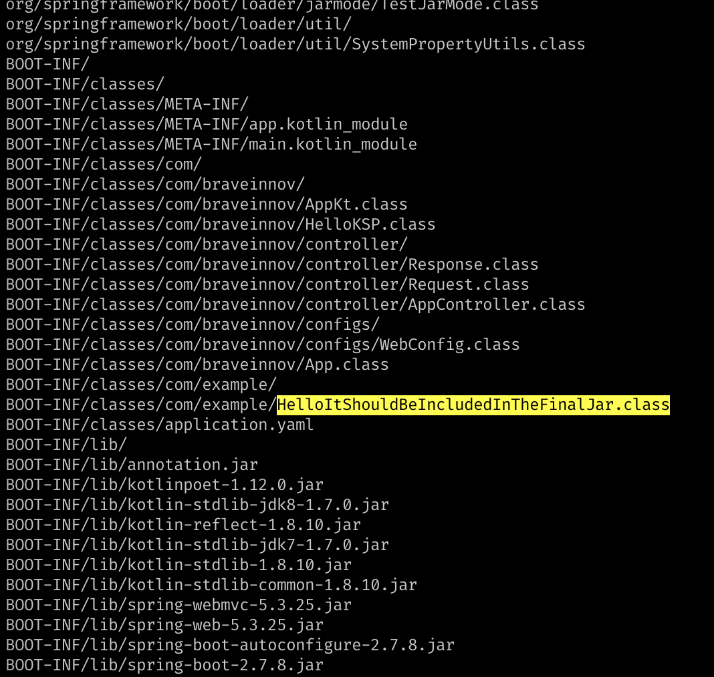

# ksp-poc

A simple project demonstrating how to use the KSP and annotation processing in Kotlin.

# What we are testing here?

## Generating kotlin file based on method execution at compilation time. 

Task: `runScriptAndGenerateFiles`

The `AppController` class declares the method `definedTypes`. This method returns a `Map<String,Any>`.
At compilation time, the task `runScriptAndGenerateFiles` is responsible for executing the `com.braveinnov.Reflector` class that will:
- Execute the method `definedTypes` from the `AppController` and generate a kotlin file based on that return.

## Compiling generated file

Task: `compileKotlinManually`

This task will invoke the `org.jetbrains.kotlin.cli.jvm.K2JVMCompiler` and compile the generated classes.

## Checking if the compilation worked

At the end the generated class should be inside the final jar.

```bash
jar -tf app/build/libs/app.jar
```

```
BOOT-INF/classes/com/braveinnov/controller/AppController.class
BOOT-INF/classes/com/braveinnov/configs/
BOOT-INF/classes/com/braveinnov/configs/WebConfig.class
BOOT-INF/classes/com/braveinnov/App.class
BOOT-INF/classes/com/example/
BOOT-INF/classes/com/example/HelloItShouldBeIncludedInTheFinalJar.class <<<
BOOT-INF/classes/application.yaml
BOOT-INF/lib/
BOOT-INF/lib/annotation.jar
BOOT-INF/lib/kotlinpoet-1.12.0.jar
BOOT-INF/lib/kotlin-stdlib-jdk8-1.7.0.jar
```



# The KSP Process


# The Custom Code Generation